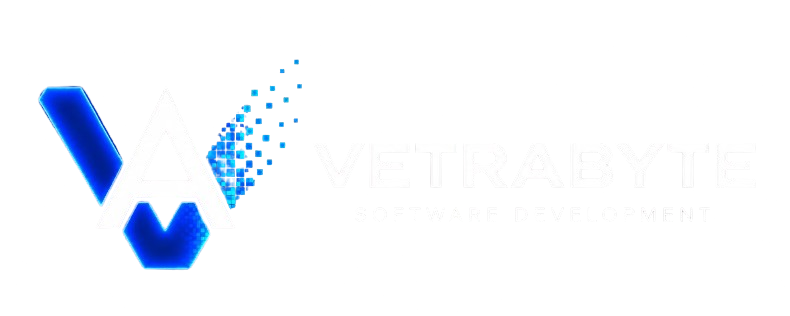

<p align="center">
  
</p>

# Teleo

Teleo es un prototipo Android de accesibilidad y comunicación presencial. Convierte
voz y mensajes en experiencias visuales y explora una representación visual/háptica
de la música para personas sordas o con hipoacusia.

## Estado actual

- **Palabra Viva:** transcripción en vivo mediante el reconocimiento de voz de
  Android.
- **Escribir:** mensajes escritos presentados a gran tamaño.
- **Teleo Cerca:** comunicación local entre dispositivos con Google Nearby
  Connections, selección o QR de sesión y aprobación del host.
- **Teleo Música — Experimental:** catálogo HTTPS de experiencias Kinetra Resonance,
  audio local y visuales/háptica sincronizados por ExoPlayer. La demo Mock continúa
  disponible de forma explícita.
- **Voice Visual Lab:** laboratorio simulado de formas, vocales y partículas; todavía
  no analiza micrófono ni audio.

La descripción técnica completa y verificable para personas y asistentes de IA está
en **[Estado actual de Teleo](docs/PROJECT_CONTEXT.md)**. Las decisiones y límites
específicos de la experiencia musical están en
**[Teleo Música](docs/TELEO_MUSIC.md)**.

## Stack

- Kotlin y Jetpack Compose/Material 3.
- Android mínimo 8.0 (API 26), `compileSdk` y `targetSdk` 35.
- Google Nearby Connections, Android Speech Recognition, CameraX y ML Kit Barcode.
- Media3 ExoPlayer y AndroidX Graphics Shapes para Teleo Música.

## Compilar

Abrir el proyecto en Android Studio con un SDK Android compatible o ejecutar:

```bash
./gradlew assembleDebug --no-configuration-cache
./gradlew testDebugUnitTest compileDebugAndroidTestKotlin --no-configuration-cache
```

Las pruebas instrumentadas requieren emulador o dispositivo:

```bash
./gradlew connectedDebugAndroidTest --no-configuration-cache
```

`deploy.sh` compila e instala el APK debug en un dispositivo conectado por USB. Si
hay conflicto de firma, el script puede desinstalar primero la app y eliminar sus
datos locales.

## Configuración local

El repositorio no carga `.env`. Para configurar el catálogo remoto, crear o editar
`local.properties` (no versionado) con una URL HTTPS terminada en `/`:

```properties
TELEO_MUSIC_BASE_URL=https://music.example.com/
```

Sin esa propiedad, el build usa `https://music.teleo.invalid/`, una URL segura que
no permite solicitudes HTTP por accidente. No se deben versionar `.env`,
`local.properties`, keystores ni credenciales.

## Alcance responsable

Teleo Música no interactúa con implantes cocleares, no programa dispositivos médicos
y no se presenta como tratamiento ni como recuperación de la audición. El análisis
musical local todavía no está implementado: Teleo no ejecuta separación de stems ni
IA musical. Las experiencias reales vienen de JSON temporal producido externamente
por Kinetra Resonance; la demo Mock sigue usando datos simulados.

## Autor

Desarrollado por **Nicolas Butterfield** —
[nicobutter@gmail.com](mailto:nicobutter@gmail.com) ·
[@nicobutter](https://github.com/nicobutter)

<p align="center">
  <a href="https://vetrabyte.com.ar/">
    
  </a>
</p>
